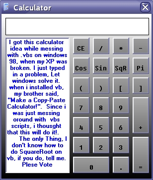



## a Copy\-Paste Calculator Thing

### Description

I have finally made a totally perfect Copy-Paste calculator. it's a cool thing that understands ALL the algebra and math problems, simply a SCIENTIFIC calculator. only one thing, i do not know how to make this calc have SquareRoot.
 
### More Info
 

             |
---                |---
**Submitted On**   |2002-08-11 12:00:58
**By**             |[Leo Barsukov](https://github.com/Planet-Source-Code/PSCIndex/blob/master/ByAuthor/leo-barsukov.md)
**Level**          |Advanced
**User Rating**    |5.0 (20 globes from 4 users)
**Compatibility**  |VB 6\.0
**Category**       |[Jokes/ Humor](https://github.com/Planet-Source-Code/PSCIndex/blob/master/ByCategory/jokes-humor__1-40.md)
**World**          |[Visual Basic](https://github.com/Planet-Source-Code/PSCIndex/blob/master/ByWorld/visual-basic.md)
**Archive File**   |[a\_Copy\-Pas1181228142002\.zip](https://github.com/Planet-Source-Code/leo-barsukov-a-copy-paste-calculator-thing__1-37948/archive/master.zip)

